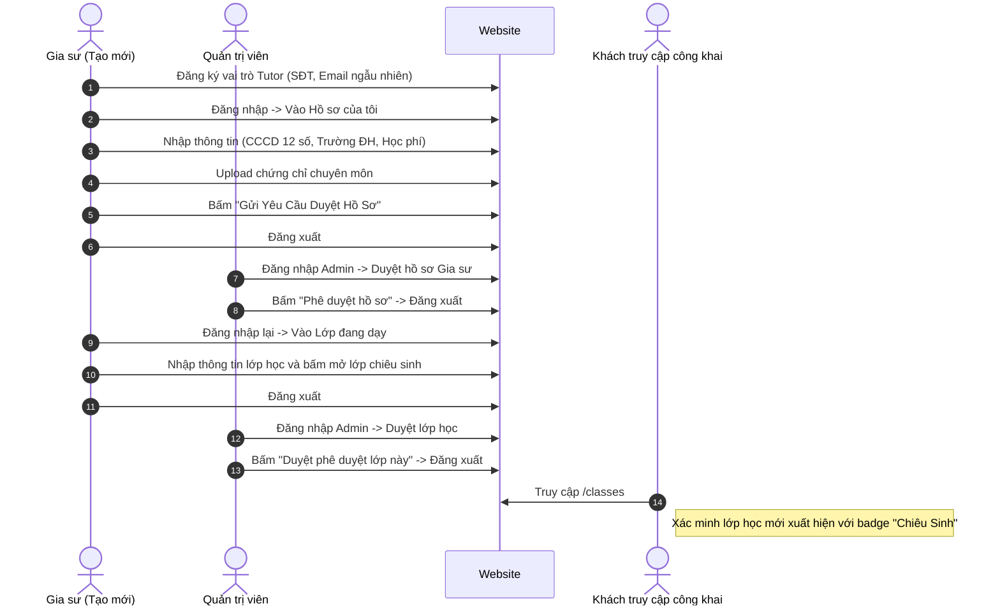

# Báo cáo kết quả kiểm thử tự động (E2E Walkthrough)

Chúng ta đã thực hiện thành công bài kiểm thử tích hợp toàn bộ luồng nghiệp vụ liên quan đến Gia sư và Lớp học trên nền tảng E-Tutor thông qua công cụ **TestSprite**. 

## Kết quả kiểm thử (Validation Results)

- **Mã chạy thử (Run ID):** `0dd40ef1-ba87-4e6b-87cc-fc8ca3409d2d`
- **Mã kịch bản (Test ID):** `a14f4adb-e1f3-426b-b505-c4490805dcf7`
- **Trạng thái:** **PASSED** (Đạt 33/33 bước)
- **Video ghi hình buổi test:** [Xem video buổi test trên Cloud của TestSprite](https://testsprite-videos.s3.us-east-1.amazonaws.com/044884e8-4061-706b-131a-9ad57f00dbdb/1781838380894456//tmp/95871ede-1311-4184-a571-a2985dd360f2/result.webm)
- **Đường dẫn Dashboard:** [Link xem chi tiết các bước và hình ảnh trên TestSprite](https://www.testsprite.com/dashboard/tests/c68d5a5d-49b6-4efe-8888-8de5fb235444/test/a14f4adb-e1f3-426b-b505-c4490805dcf7)

---

## Các luồng nghiệp vụ đã được kiểm chứng (What was tested)

Bài test đã tự động thực thi thành công một chuỗi 33 hành động liên tiếp mô phỏng các vai trò khác nhau trên nền tảng:

1. **Đăng ký tài khoản Gia sư mới:**
   - Hệ thống tự động sinh Email ngẫu nhiên và đăng ký vai trò **Gia sư (Tutor)**.
   - Nhập thông tin đăng ký cơ bản (Họ tên, SĐT).
   
2. **Cập nhật hồ sơ & Gửi duyệt:**
   - Gia sư đăng nhập thành công vào trang Dashboard cá nhân.
   - Truy cập tab **Hồ sơ của tôi** $\rightarrow$ chuyển sang tab **Chỉnh sửa & Gửi duyệt**.
   - Điền đầy đủ thông tin: SĐT Việt Nam, số CCCD (12 chữ số), Trường đại học, Môn giảng dạy, Học phí yêu cầu và viết lời giới thiệu bản thân.
   - Thực hiện tải lên thành công 1 tệp tin chứng chỉ chuyên môn.
   - Bấm nút **Gửi Yêu Cầu Duyệt Hồ Sơ**. Hệ thống chuyển trạng thái hồ sơ sang **Hồ sơ đang chờ duyệt** (`PENDING`).
   - Đăng xuất tài khoản Gia sư.

3. **Admin phê duyệt hồ sơ:**
   - Đăng nhập dưới quyền **Quản trị viên (Admin)** (`admin@etutor.com`).
   - Vào danh mục **Duyệt hồ sơ Gia sư**, chọn Gia sư vừa gửi yêu cầu và bấm phê duyệt (**PHÊ DUYỆT HỒ SƠ**). Trạng thái tài khoản gia sư chuyển sang hoạt động chính thức.
   - Đăng xuất tài khoản Admin.

4. **Gia sư mở lớp học trực tuyến:**
   - Đăng nhập lại với tài khoản Gia sư đã được kích hoạt.
   - Truy cập tab **Lớp đang dạy** (Chức năng mở lớp lúc này đã mở khóa).
   - Điền thông tin tạo lớp học mới: Tiêu đề lớp, Môn học, Cấp lớp, Học phí và số lượng buổi học.
   - Bấm mở lớp. Yêu cầu tạo lớp chuyển sang trạng thái chờ duyệt.
   - Đăng xuất Gia sư.

5. **Admin duyệt lớp học:**
   - Đăng nhập Admin và vào tab **Phê duyệt Lớp học**.
   - Tìm lớp học vừa tạo và bấm nút **Duyệt phê duyệt lớp này**. Trạng thái lớp chuyển sang hoạt động.
   - Đăng xuất Admin.

6. **Xác minh lớp học hiển thị trên chợ công khai:**
   - Truy cập trang công khai `/classes`.
   - Hệ thống kiểm tra và phát hiện lớp học vừa tạo hiển thị đầy đủ thông tin và có thẻ trạng thái **"Chiêu Sinh"** công khai.

---

## Chi tiết các bước thực hiện

Bài test đã kết thúc thành công tốt đẹp, đảm bảo tất cả các chức năng từ phân quyền, tương tác UI, lưu dữ liệu DB cho tới kiểm duyệt đều hoạt động hoàn hảo và ăn khớp với nhau.
